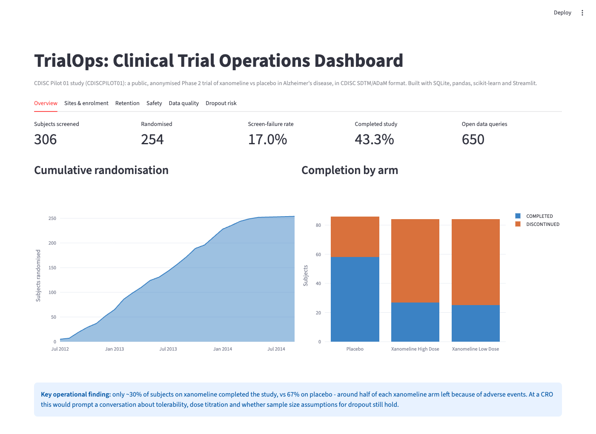
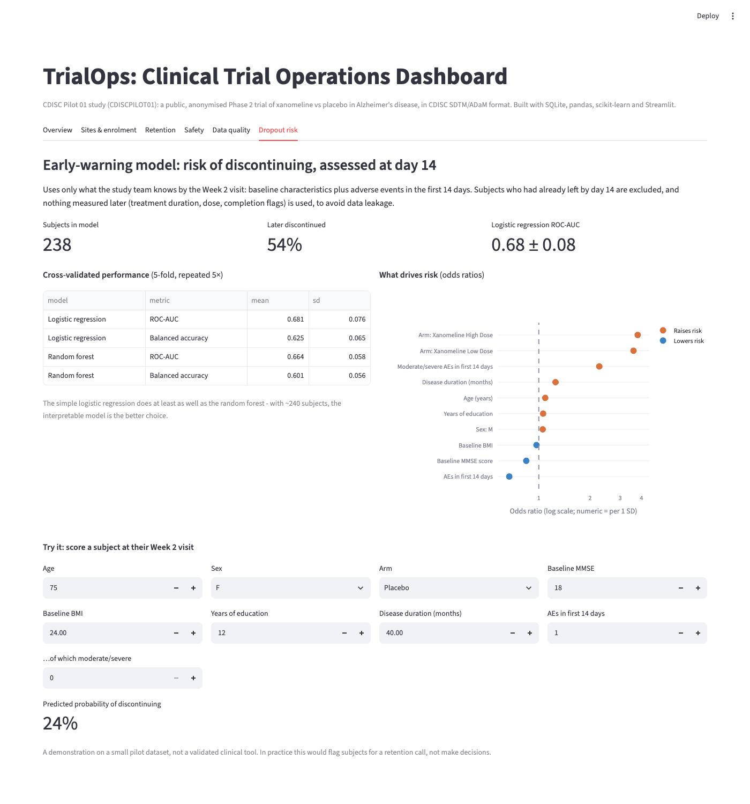
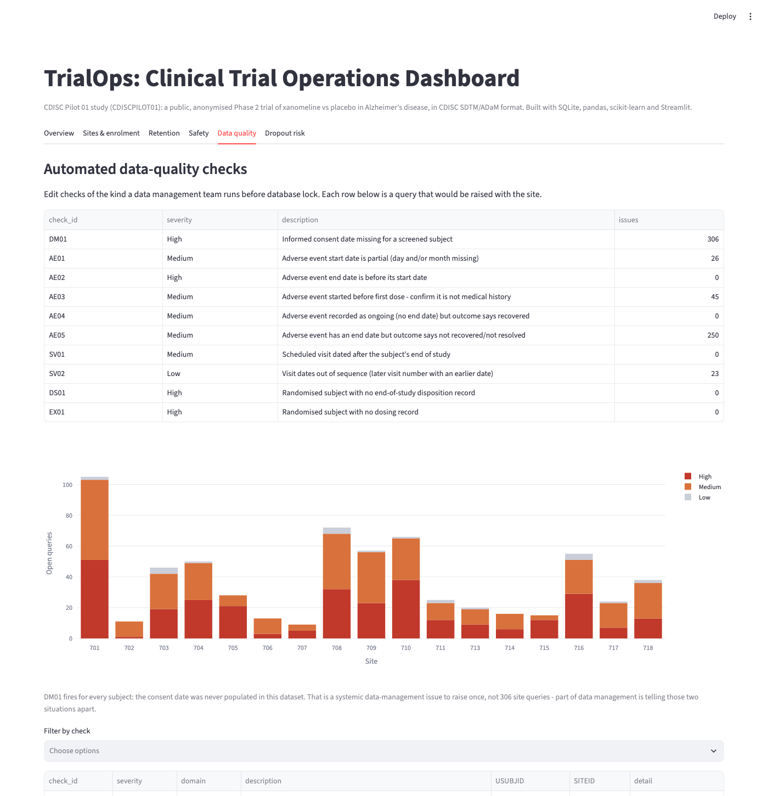

# TrialOps — clinical trial operations dashboard

**Turning raw CDISC clinical trial data into the operational views a trial team uses day to day:
site performance, recruitment, retention, safety, data quality, and early warning of subjects at risk of dropping out.**

[](https://github.com/Alaska050/trialops/actions/workflows/ci.yml)




---

## At a glance

|  |  |
|---|---|
| **Data** | CDISC Pilot 01 — a public, anonymised Phase 2 trial in Alzheimer's disease |
| **Scale** | 306 subjects screened · 254 randomised · 17 sites · 1,191 adverse events |
| **Pipeline** | SDTM/ADaM `.xpt` → SQLite → SQL analysis → Streamlit dashboard |
| **Stack** | Python · SQL · pandas · scikit-learn · Streamlit · Plotly · pytest |
| **Tests** | 7 passing, including a guard against data leakage in the model |

**New here?** The two parts worth looking at first are the **Data quality** tab
(10 edit checks written as SQL) and the **Dropout risk** tab (a landmark model with
explicit leakage control). Those are the sections below on
[data quality](#data-quality-checks) and [modelling decisions](#modelling-decisions).

## Why I built this

Contract research organisations (CROs) run trials across dozens of sites. Knowing early
which sites are under-recruiting, which subjects are likely to drop out, and where the data
needs cleaning directly affects timelines and cost.

I wanted to build that end to end: from raw SDTM files, through a relational database and
SQL, to a tool a clinical trial manager could actually open on a Monday morning. The interesting
problems here are not the charts — they are deciding *what question each view answers*, writing
checks that produce actionable queries rather than noise, and building a predictive model that
respects when information actually becomes available.

## The data

The **CDISC Pilot 01 study (CDISCPILOT01)**: a public, anonymised Phase 2 trial of xanomeline
(low and high dose) vs placebo in mild-to-moderate Alzheimer's disease, published by PHUSE for
testing clinical data tools ([phuse-org/phuse-scripts](https://github.com/phuse-org/phuse-scripts)).

| Dataset | Standard | Contents | Rows |
|---|---|---|---|
| `dm` | SDTM | Demographics, one row per screened subject | 306 |
| `ds` | SDTM | Disposition: completed or discontinued, and why | 596 |
| `sv` | SDTM | Actual dates of every subject visit | 3,559 |
| `ae` | SDTM | Adverse events (MedDRA-coded) | 1,191 |
| `ex` | SDTM | Dosing / exposure | 591 |
| `adsl` | ADaM | Subject-level analysis dataset (baseline characteristics, flags) | 254 |

No patient-identifiable data is involved: the dataset is public and fully anonymised.

## How it works

```
data/raw/*.xpt          SAS transport files (SDTM + ADaM)
        │
        │  trialops/build_db.py
        │  · blanks -> NULL, so SQL aggregates behave
        │  · SAS numeric dates -> ISO date strings
        ▼
data/trialops.db        SQLite, one table per domain
        │
        ├── sql/01-07_*.sql      analysis queries (CTEs, joins, window functions)
        ├── trialops/checks.py   10 edit checks, each declared as a SQL query
        └── trialops/model.py    landmark dropout model + cross-validated evaluation
        │
        ▼
app.py                  Streamlit dashboard, 6 tabs
```

The database is rebuilt from the `.xpt` files on first run, so the repo stays small and there
is no binary database in version control.

## What the dashboard shows

| Tab | Question it answers | Techniques |
|---|---|---|
| **Overview** | How is the study doing overall? | KPIs, cumulative recruitment curve |
| **Sites & enrolment** | Which sites recruit well, which screen-fail a lot, and which run visits outside the protocol window? | SQL CTEs, `RANK()` window function, adjustable visit-window parameter |
| **Retention** | When and why do subjects leave, by arm? | Retention funnel, disposition analysis |
| **Safety** | Which body systems are affected, and do any sites report unusually many or few AEs? | Subject-level AE rates, site outlier view |
| **Data quality** | What needs to go back to the sites before database lock? | 10 automated edit checks in SQL, downloadable query listing |
| **Dropout risk** | Which subjects are at risk of leaving, judged at their Week 2 visit? | Landmark design, leakage control, repeated cross-validation, odds ratios |

## Key findings

**Retention is the main operational risk.** About 30% of subjects on xanomeline completed the
study (32% high dose, 30% low dose), against 67% on placebo. Roughly half of each xanomeline arm
discontinued because of adverse events — most commonly itching and redness, at the skin patch
site and elsewhere on the skin. On a live study this is the signal that would drive a protocol
or patch-formulation conversation early, rather than at database lock.

**Site performance varies widely.** Screen-failure rates range from 0% to 67% across the 17 sites.
Two small sites held half or more of their scheduled visits outside a ±7 day window (59% and 50%),
making them candidates for retraining or a for-cause monitoring visit. Both have low visit counts,
so the percentages need reading with care — which the dashboard shows alongside the rate.

**Data quality findings are actionable, not just counts.** The checks surfaced partial AE start
dates, AEs starting before first dose that may belong in medical history, and outcomes that
contradict end dates. They also show that one check fires for *every* subject because consent
dates were never populated — a single systemic issue to raise once, not 306 site queries.
Telling those two situations apart is most of the value.

**The early-warning model works, modestly and honestly.** Using only information available at
day 14, a logistic regression predicts later discontinuation with a cross-validated ROC-AUC of
about 0.68. Treatment arm and moderate/severe AEs in the first two weeks are the strongest
drivers. The simple, interpretable model did at least as well as a random forest (≈0.66).



## Data quality checks

Each check is declared as data — an ID, a severity, a description and a SQL query — so adding a
new one means adding a query, not writing new application code.

| ID | Severity | Check | Issues found |
|---|---|---|---|
| DM01 | High | Informed consent date missing for a screened subject | 306 |
| AE01 | Medium | Adverse event start date is partial (day and/or month missing) | 26 |
| AE02 | High | Adverse event end date is before its start date | 0 |
| AE03 | Medium | Adverse event started before first dose — confirm it is not medical history | 45 |
| AE04 | Medium | Adverse event ongoing (no end date) but outcome says recovered | 0 |
| AE05 | Medium | Adverse event has an end date but outcome says not recovered | 250 |
| SV01 | Medium | Scheduled visit dated after the subject's end of study | 0 |
| SV02 | Low | Visit dates out of sequence | 23 |
| DS01 | High | Randomised subject with no end-of-study disposition record | 0 |
| EX01 | High | Randomised subject with no dosing record | 0 |

The checks returning zero matter as much as the ones that fire: they are evidence the database is
clean on those dimensions, which is exactly what a data manager needs before lock.



The tab also breaks open queries down by site and severity, so a data manager can see at a glance
where the cleaning effort actually sits — and filter to a single check to produce the query listing
for one site.

## Modelling decisions

- **Landmark at day 14.** A prediction is only useful if the information exists when you make it.
  Subjects who had already left before day 14 are excluded (238 remain, 54% of whom later
  discontinued), and only AEs starting on or before day 14 are used.
- **No data leakage.** Treatment duration, cumulative dose and completion flags are excluded,
  because they are only known *after* the outcome. A unit test enforces this, so the constraint
  cannot be quietly broken later.
- **Small data, honest evaluation.** With about 240 subjects I used repeated stratified 5-fold
  cross-validation rather than a single train/test split, and report the mean and standard
  deviation. The SD is roughly ±0.07, so run-to-run variation is real and quoted as such.
- **Interpretability earned its place.** Logistic regression matched the random forest and gives
  odds ratios a clinical team can argue with.

## Project structure

```
trialops/
├── app.py                  # Streamlit dashboard (6 tabs)
├── trialops/
│   ├── build_db.py         # .xpt (SAS transport) -> SQLite
│   ├── checks.py           # data-quality edit checks, declared as data
│   └── model.py            # landmark dropout model, CV evaluation, odds ratios
├── sql/                    # analysis queries (CTEs, joins, window functions)
├── tests/                  # pytest: loading, SQL integrity, checks, leakage guard
├── docs/                   # screenshots used in this README
└── data/raw/               # CDISC pilot SDTM/ADaM .xpt files
```

## Run it

```bash
python3 -m venv .venv && source .venv/bin/activate
pip install -r requirements.txt
python -m trialops.build_db      # builds data/trialops.db (the app also does this on first run)
python -m pytest -q              # 7 tests
streamlit run app.py
```

To reproduce the analysis outside the dashboard:

```bash
python -m trialops.checks        # prints the data-quality summary
python -m trialops.model         # prints CV results + odds ratios (~30 s)
```

Dependency versions in `requirements.txt` are pinned exactly, so a fresh clone installs the same
stack this was built and tested against (Python 3.11).

## Limitations

This is a demonstration on one small public pilot study, not a validated clinical tool.

- **One study, 254 randomised subjects.** The model shows the approach; the numbers would not
  transfer to another trial without refitting.
- **ROC-AUC ≈ 0.68 is modest.** In practice this would flag subjects for a retention call, not
  drive any clinical decision.
- **Retention by visit is not monotonic**, because telephone visits are counted separately from
  the site visits they sit between.
- **The ±7 day visit window is a stand-in.** A real protocol defines its own windows per visit,
  which is why the window is an adjustable parameter rather than a hard-coded rule.

## Next steps

- A Power BI or Tableau version of the site-performance view
- More edit checks using the LB (labs) and CM (concomitant medications) domains
- Survival analysis (time to discontinuation) as a complement to the classifier

## Licence and data

Code is MIT licensed. The CDISC Pilot 01 data is published by PHUSE and CDISC for public use in
testing and training; it is anonymised and contains no patient-identifiable information.
